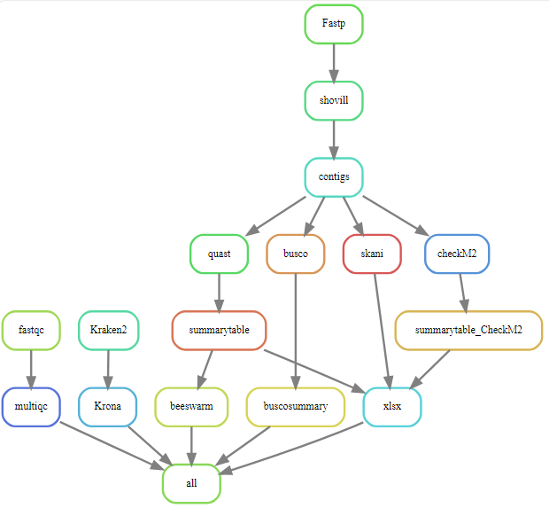

# Illumina pipeline
Marie Hannaert\
ILVO

Illumina pipeline is a pipeline to analyze short-reads from Illumina.
This repository is a snakemake workflow that can be used to analyze short-read data specific for bacterial genomes. Everything needed can be found in this repository. I made this pipeline during my traineeship by ILVO-Plant. 

## Installing the Illumina pipeline
Snakemake is a workflow management system that helps to create and execute data processing pipelines. It requires Python 3 and can be most easily installed via the bioconda package.

### Installing Mamba
The first step to installing Mamba is installing Miniforge:
#### Unix-like platforms (Mac OS & Linux)
````
$ curl -L -O "https://github.com/conda-forge/miniforge/releases/latest/download/Miniforge3-$(uname)-$(uname -m).sh"
$ bash Miniforge3-$(uname)-$(uname -m).sh
````
or 
````
$ wget "https://github.com/conda-forge/miniforge/releases/latest/download/Miniforge3-$(uname)-$(uname -m).sh"
$ bash Miniforge3-$(uname)-$(uname -m).sh
````
If this worked the installation of Mamba is done, if this didn't work you can check the documentation of Miniforge with the following link:
[MiniForge](https://github.com/conda-forge/miniforge#mambaforge)
### Installing Bioconda 
Then perform a one-time set up of Bioconda with the following commands. This will modify your ~/.condarc file:
````
$ mamba config --add channels defaults
$ mamba config --add channels bioconda
$ mamba config --add channels conda-forge
$ mamba config --set channel_priority strict
````
When you followed these steps Bioconda normally is installed, when it still doesn't work you can check the documentation with the following link: [Bioconda](https://bioconda.github.io/)
### Installing Snakemake 
Now creating the Snakemake enviroment, we will do this by creating a snakemake mamba enviroment:
````
$ mamba create -c conda-forge -c bioconda -n snakemake snakemake
````
If this was succesfull you can now use the following commands for activation and for help: 
````
$ mamba activate snakemake
$ snakemake --help
````
To check the documentation of Snakemake you can use the following link: [Snakemake](https://snakemake.readthedocs.io/en/stable/getting_started/installation.html)


### Downloading the Illumina pipeline from Github
When you want to use the Illumina pipeline, you can download the complete pipeline, including: scripts, conda enviroments, ... on your own local maching. Good practise is to make a directory **Snakemake/** where you can collect all of your pipelines. Downloading the Illumina pipeline in your snakemake directory can be done by the following command: 
````
$ cd Snakemake/ 
$ git clone https://github.com/MarieHannaert/Illumina_Snakemake.git
````
### Making a database for Kraken2
For Kraken2 you need to make a database. The database that is used in my pipeline is [Standard database](https://benlangmead.github.io/aws-indexes/k2). 
After downloading you need to specify the path to this database. This can be done in the **Snakemake/Illumina_Snakemake/Snakefile**, line 73.

### Making the database that is used for skANI
For using skANI you need to have a database, you can create one according to the following link: 
[Creating a database for skANI](https://github.com/bluenote-1577/skani/wiki/Tutorial:-setting-up-the-GTDB-genome-database-to-search-against)

When your database is installed you need to changed this path to the database in the Snakefile **Snakemake/Illumina_Snakemake/Snakefile**, line 152. 


Now the snakemake enviroment is ready for use with the pipeline. 
## Executing the Illumina pipeline 
Before you can execute this pipeline you need to perform a couple of preparing steps. 
### Preparing
In the **Illumina_Snakemake/** you need to make the following directories: **data/samples**
````
$ cd Illumina_Snakemake/
$ mkdir data/samples
````
In the samples directory you need to palce the samples that you want to analyse. They must look like the following two samples:
- sample1_1.fq.gz
- sample1_2.fq.gz
- sample2_1.fq.gz
- sample2_2.fq.gz

If this is done there is one more important step left: 
#### Activation of Krona 
To install the local taxonomy database you must run the following commands: 
````
$ bash .snakemake/conda/cce02dcec3898e2025b146bc478991b8/opt/krona/updateTaxonomy.sh
````
Before you can do/find this you will probably first have to execute the snakemake one time. This is needed because then it will install the needed conda enviroments. So if you get an error don't panic, this is normal by the first execution. This info can be found on: [KronaTools](https://github.com/marbl/Krona/wiki/Installing)

## Executing the Illumina pipeline
Now everything is ready to run the pipeline. 
If you want to run the pipeline without any output, just checking it it works, you can use the following command in the **Illumina_Snakemake/**: 
````
$ snakemake -np
````
Now you will get an overview of all the steps in the pipeline. 

If you want to execute the pipeline and your samples are place in the **data/samples** directory, you can use the following command: 
````
$ snakemake -j 4
````
The -j option is needed when you work on a local server, this defines the number of treads that will be used to perform the pipeline, so you can chose the number yourself. 

### Pipeline content
The pipeline has eight big steps. Besides these steps there are some side steps to make summaries and visualisations. 
#### Fastqc 
This step is done on the samples, and this will generate a quality report per sample. 

FastQC documentation: [Fastqc](https://www.bioinformatics.babraham.ac.uk/projects/fastqc/)
#### Multiqc
Multiqc will generate one html report of all the reports of fastqc. 

Multiqc documentation: [Multiqc](https://multiqc.info/docs/)
#### Kraken2
Kraken will also start from the samples them self. It will generate a report file for each sample. 
Kraken2 is a a taxonomic classification system using exact k-mer matches to achieve high accuracy and fast classification speeds.

Kraken2 documentation: [Kraken2](https://ccb.jhu.edu/software/kraken2/)
#### Krona
Krona will use the report files that were generated by Kraken2. Krona will make a kronaplot from this information, so the resports will be visualised. 

Krona documentation: [Krona](https://github.com/marbl/Krona/wiki/KronaTools)
#### Fastp
Fastp will start from the samples, but will use the pairs. Fastp will trim the reads, so that these reads are ready to be used for assembly. 

Fastp documentation: [Fastp
](https://github.com/OpenGene/fastp)
#### Shovill
Shovill will perform the assembly from the output of fastp. The assembly will be done with spades. 

Shovill documentation: [Shovill](https://github.com/tseemann/shovill)
#### skANI
skANI is a program for calculating average nucleotide identity (ANI) from DNA sequences (contigs/MAGs/genomes) for ANI > ~80%.
The output of skANI is a summary file: **skani_results_file.txt**, this info will be put in a xlsx file togheter with Quast summary file. 

SkANI documentation: [skANI](https://github.com/bluenote-1577/skani)
#### Quast
Quast is a Quality Assessment Tool for Genome Assemblies by CAB. The output will be a directory of each sample. From these directories we will make a summary file: **quast_summary_table.txt**. The information of this summary file will also be added to the XLSX file togheter with skANI summary file, the result can be found in the file **skANI_Quast_output.xlsx**. From the summary file of Quast we will also make some beeswarm visualisation vor the number of contigs and the N50. This can be found in the following file **beeswarm_vis_assemblies.png**. 

Quast documentation: [Quast](https://quast.sourceforge.net/)
#### Busco
Assessing Genome Assembly and Annotation Completeness.
Based on evolutionarily-informed expectations of gene content of near-universal single-copy orthologs, the BUSCO metric is complementary to technical metrics like N50.
The output of Busco is a directory for each sample. To make it more visible, there will be made a summary graph per fifteteen samples. 

Busco documentation: [Busco](https://busco.ezlab.org/)
## Finnish
When your done executing the pipeline you will find the following structure in you **Illumina_Snakemake/**:
````
Snakemake/
├─ Illumina_Snakemake/
|  ├─ .snakemake
│  ├─ data/
|  |  ├─sampels/
|  ├─ envs
|  ├─ scripts/
|  |  ├─beeswarm_vis_assemblies.R
|  |  ├─busco_summary.sh
|  |  ├─skani_quast_to_xlsx.py
|  ├─ Snakefile
│  ├─ results/
|  |  ├─00_fastqc/
|  |  ├─01_multiqc/
|  |  ├─02_Kraken2/
|  |  ├─03_krona/
|  |  ├─04_fastp/
|  |  ├─05_shovill/
|  |  ├─06_skani/
|  |  ├─07_quast/
|  |  ├─08_busco/
|  |  ├─assemblies/
|  |  ├─busco_summary/
│  ├─ README
│  ├─ logs
````
## Overview of Illumina pipeline
